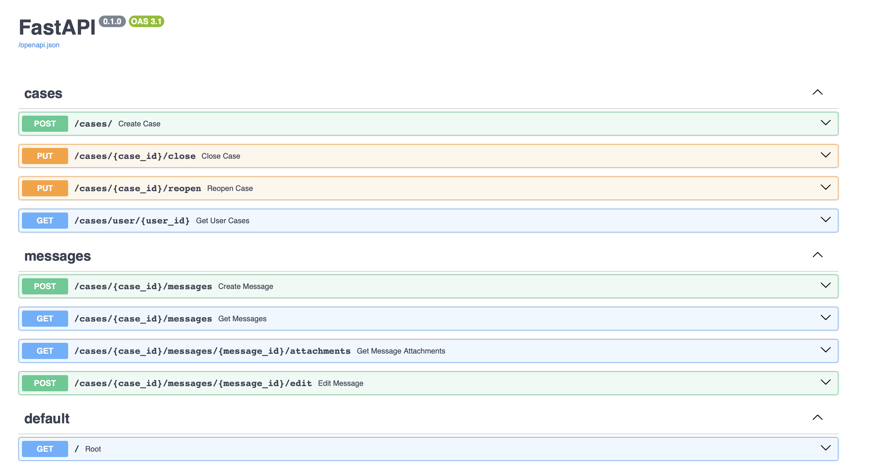
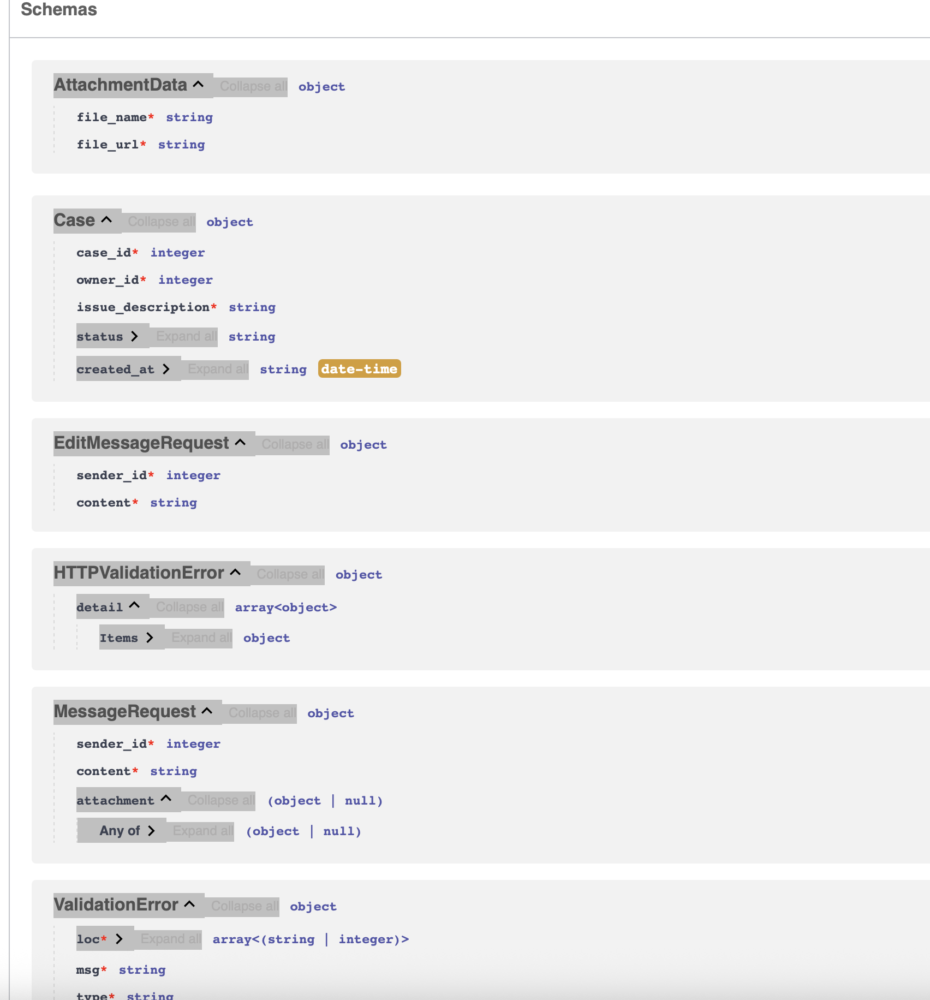

# case-copilot-api
A Chat Application Backend that handles and support opening a case and chatting with staff members and the AI assistant.

> A RESTful API built with FastAPI to manage cases, messages, and attachments, including thumbnail generation for image attachments.

---

## Design Choices & Reasoning

- **FastAPI**: Chosen for its speed, developer ergonomics, and built-in data validation with Pydantic.
- **In-memory data stores**: Used simple Python lists to mimic database tables for ease of demonstration (DB implementation for future enhancement).
- **Pydantic models**: Employed for clear data validation and serialization on input/output.
- **Modular structure**: Split models, routes, and utilities into separate files/directories to keep code organized and maintainable.
- **Thumbnail generation**: Used `requests` to fetch remote images and `Pillow` for image processing, balancing simplicity and efficiency. (There can be other libraries )
- **User role checks and message validation**: Enforced strict rules about who can message which cases and who can edit messages to mimic real-world permissions.

---


## Objective

This allow a logged-in user to open a new case for a specific healthcare issue that they want our help with. Once opened, a case will be presented to the user as a standard chat UX in our web and mobile apps. You will focus on creating data models and an API service to support opening a case and chatting with Medbill AI staff members and the AI assistant.

The basic considerations for the service should include:

- Users,Office staff, and AI assistants can all interact with a case via the API. However, each case is owned by a specific user.
    - Note that direct user-to-user messaging is not allowed.
- Users and staff members can attach files (images and documents) to a case.

- A user may open multiple cases.
- Chat messages and attachments belong to a case. Maintaining a separate “chat” concept is not necessary - the UX for a case is a chat conversation.
- User able to attach files


## Directory structure
```
fastapi_case_app/
├── main.py
├── models/
│   ├── case.py
│   ├── message.py
│   ├── attachment.py
│   └── user.py
├── data/
│   ├── attachment_store.py
│   ├── case_store.py
│   ├── message_store.py
│   └── user_store.py
├── routes/
│   ├── case_routes.py
│   └── message_routes.py
├── utilities/
│   └── thumbnail_generator.py
└── requirements.txt

```


- **Models** handle validation and data representation.
- **Routes** implement the REST API endpoints, referencing the data stores.
- **Utilities** hold auxiliary logic like thumbnail generation.

---

## Setup & Running the Service

### Prerequisites

- Python 3.8 or higher installed
- `pip` for package management

### Installation Steps

1. Clone the repository:

    ```bash
    git clone https://github.com/sudhirslab/case-copilot-api.git
    cd case-copilot-api
    ```

2. Start Application
    ```bash
    make install
    ```

5. Access the API docs (Swagger UI) at:

    ```
    http://127.0.0.1:8000/docs
    ```




---

## Known Limitations & Areas for Improvement

- **In-memory storage**: Data resets on every restart; no persistence.
- **No authentication**: The API trusts the provided `sender_id` and other IDs without verifying identity. And most of them are natural numbers. (UUID could have been implemented)
- **Thumbnail storage path**: Currently hardcoded to a local directory without cleanup or management.
- **Error handling**: Basic error messages without standardized error response schemas.
- **Concurrency considerations**: No locking or concurrency safety around the shared in-memory lists.
- **Tests**: No automated tests currently implemented.

---

## Future Enhancements & Ideas

- Integrate a proper database (e.g., SQLite, PostgreSQL) for persistent storage.
- UUID implementation for the ID related fields
- Add user authentication and authorization, e.g., OAuth or JWT tokens.
- Implement pagination and filtering for messages and cases.
- Add API rate limiting and logging middleware.
- Improve thumbnail handling: caching, async generation, and cleanup of old thumbnails.
- Add automated testing suite (unit and integration tests).
- Dockerize the application for containerized deployment.
- Support additional file types and richer attachment metadata.
- Add notifications (email, push) for new messages or case status changes.
- Adding caching layer storing created cased for large scale

---

## Contact & Contributions

Feel free to open issues or submit pull requests. 
For questions, contact: [sudhirp@duck.com]

---


